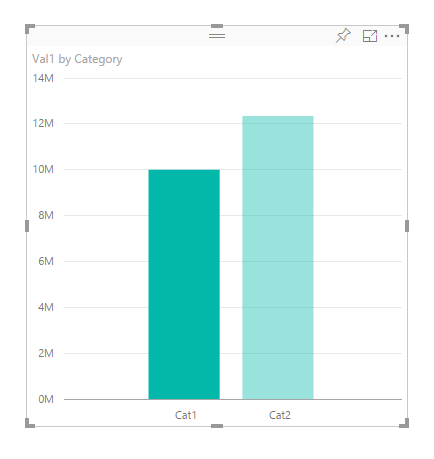

#Handling Selection

Most visuals allow users to select data points or categories by clicking them with the mouse. 

For example, in stacked column chart you can select a particular bar.



##Creating Selection IDs `SelectionIdBuilder`

In order for the visual host to track selected items for your visual and apply cross-filtering to other visuals, you have to generate and store a `SelectionId` for every selectable item. You can use the `SelectionIdBuilder` to generate selection ids.

**Initialize a SelectionIdBuilder**

First, you need to create a `SelectionIdBuilder` in your constructor and store it in a private variable in your visual class for later use.

```typescript
class MyVisual implements IVisual {
    
    private selectionIdBuilder: ISelectionIdBuilder;
    
    constructor(options: VisualConstructorOptions) {
        this.selectionIdBuilder = options.host.createSelectionIdBuilder();
    }
}
```

**Generating Selection Ids**

```typescript
var categoricalData = dataView[0].categorical;
var category = categoricalData.categories[0];
var categories = categoricalData.values;
var item = categorical.values[i];

var selector: ISelectionId = this.selectionIdBuilder
    .withSeries(cats, item)
    .withMeasure(item.source.queryName)
    .withCategory(categorical.categories[0], j)
    .createSelectionId();
```

##Managing Selection `SelectionManager`

You can use `SelectionManager` to notify the visual host of changes in the selection state. 

**Initialize a SelectionManager**

First, you need to create a `SelectionManager` in your constructor and store it in a private variable in your visual class for later use.

```typescript
class MyVisual implements IVisual {
    
    private selectionManager: ISelectionManager;
    
    constructor(options: VisualConstructorOptions) {
        this.selectionManager = options.host.createSelectionManager();
    }
}
```

**Setting selection**

To select an item simply call `select` on the selectionManager passing in the `SelectionId` of the item you want to select. If there are any other items selected the selection manager will automatically deselect them.

The select function returns a promise that will resolve with an array of currently selected ids.

```typescript
this.selectionManager.select(selector).then((ids: ISelectionId[]) => {
    //called when setting the selection has been completed successfully
});
```

**Multiple selection**

To support multi-selection you can provide the optional second parameter with a `true` value. When this is set it will not clear previous selection and just add the new selection to the list of selected ids. 

```typescript
this.selectionManager.select(selector, true).then((ids: ISelectionId[]) => {
    //called when setting the selection has been completed successfully
});
```

**Clearing selection**

To clear selection simply call `clear` on the selection manager. This also retruns a promise that will resolve once the selection is cleared successfully.

```typescript
this.selectionManager.clear().then(() => {
    //called when clearing the selection has been completed successfully
});
```